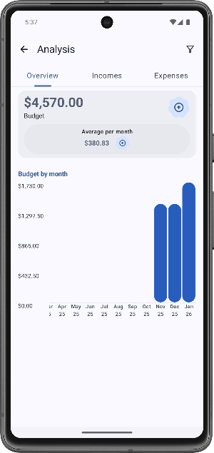
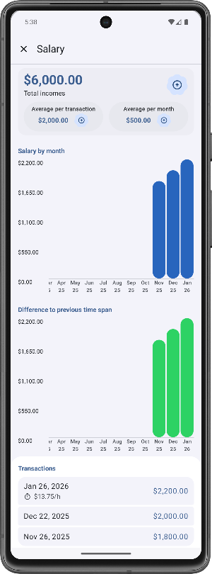

# Analysis
This document describes the analysis algorithms used in Cha Ching. The app employs two different analysis algorithms: One small and one large algorithm, both for different purposes.

### Table of Contents
1. [Small Analysis](#1-small-analysis)
    * [Workflow](#11-workflow)
    * [Analysis Steps](#12-analysis-steps)
    * [Final Result](#13-final-result)
    * [Test Strategy](#14-test-strategy)
2. [Large Analysis](#2-large-analysis)
    * [Workflow](#21-workflow)
    * [Analysis Steps](#22-analysis-steps)
    * [Final Result](#23-final-result)
    * [Test Strategy](#24-test-strategy)

<br/>

***

## 1 Small Analysis
The small analysis is the less powerful out of the two analysis algorithms used in Cha Ching. This section describes the small analysis.

<br/>

### 1.1 Workflow
The following workflow illustrates how the analysis works internally:


<br/>

### 1.2 Analysis Steps
This section describes each of the analysis steps that are mentioned [above](#11-workflow).

#### 1.2.1 Query Clusters
First, the analysis queries the two latest clusters from the database. The query to get a cluster looks as follows:, where `:date` is the epoch day from which to begin searching for the latest cluster:
```sql
WITH latest AS (
    SELECT MAX(valueDate) AS maxDate FROM transfers t
    WHERE t.valueDate <= :date
    AND NOT EXISTS (SELECT 1 FROM deletedTypes d WHERE d.typeId = t.type)
)
SELECT * FROM transfers
WHERE valueDate <= (SELECT maxDate FROM latest)
    AND valueDate >= (SELECT maxDate FROM latest) - :maxClusterGap
ORDER BY valueDate ASC
```
_`:date`: Epoch day from which to begin searching for the latest cluster_  
_`:maxClusterGap`: Max number of days that is considered a cluster_

For example, assume the following transfers are available in the app:


If `:date` is something like Dec 29, 2025, the analysis would group the transfers into the following two clusters:

Latest cluster:
* Share Investment (Dec 25, 2025)
* Health Insurance (Dec 24, 2025)
* Salary (Dec 22, 2025)
* Taxes (Dec 22, 2025)

Previous cluster:
* Health Insurance (Nov 28, 2025)
* Salary (Nov 26, 2025)
* Taxes (Dec 26, 2025)

Each of these clusters is analyzed separately, so that the presentation layer can show differences between the most recent incomes and expenses to the previous ones.

#### 1.2.2 Analysis of Each Cluster
For each cluster, the transfers are summarized by type. For each type (e.g. "Salary", "Taxes", "Health Insurance" or "Share Investment"), the sums of incomes and expenses are counted. This is illustrated by the following workflow:  


The algorithm assures that a maximum of three types is returned for incomes and expenses each. If the cluster contains transfers of more than three types, all but the 3 types with the largest sums are summarized into a single instance.

This algorithm is called two tines: Once to calculate the sums of incomes and once to calculate the sums of expenses.

<br/>

### 1.3 Final Result
The final result of the small analysis is described by the following UML diagram:


The result contains two instances of `SmallMonthResult`, one for each cluster queried at the start. These can be used to display differences between the last two months (or clusters) in the user interface.

The presentation layer displays the result as follows on the main screen:


<br/>

### 1.4 Test Strategy
The small analysis is implemented using a single use case class in the application layer. This is only suitable since the analysis algorithm is rather simple and hence does not need any separation into further isolated testable steps. Therefore, we use unit tests to test the final outcome of the analysis for correctness.

Currently, the following test cases are implemented:
Test | State
--- | ---
data without special cases should be analyzed | :green_circle: Passing
more types then limit should make last types grouped | :green_circle: Passing
exactly 3 types should not be grouped | :green_circle: Passing
exactly 4 types where last type should get summarized | :green_circle: Passing
no data should return empty result | :green_circle: Passing

<br/>

***

## 2 Large Analysis
The large analysis is the mroe powerful out of the two analysis algorithms used in Cha Ching. This section describes the large analysis.

<br/>

### 2.1 Workflow
The following workflow illustrates how the analysis works internally:


<br/>

### 2.2 Analysis Steps
This section describes each of the analysis steps that are mentioned [above](#21-workflow).

#### 2.2.1 Query Transfers
In the first step, the data for the analysis is queried from the database. For each time span, the analysis use case executes two database queries through a repository.  
The first query is used to get a list of all types, while the second query is used to get all transfers within the specified time span.

The following code shows the SQL query used to get all relevant transfers:
```sql
SELECT * FROM transfers t
WHERE valueDate BETWEEN :startEpochDay AND :endEpochDay
    AND NOT EXISTS (SELECT 1 FROM deletedTypes d WHERE d.typeId = t.type)
ORDER BY valueDate DESC
```
_`:startEpochDay`: Epoch day at which the time span begins_  
_`:endEpochDay`: Epoch day at which the time span ends_  

The query addresses the following concerns:
* **Time constraints:** The condition `valueDate BETWEEN :startEpochDay AND :endEpochDay` assures that only transfers within the specified time span are returned.
* **Disregard deleted types:** Transfers of types that were moved to the trash are disregarded from the analysis through the condition `NOT EXISTS (SELECT 1 FROM deletedTypes d WHERE d.typeId = t.type)`.
* **Result order:** The resulting list of transfers is ordered by the value date through `ORDER BY valueDate DESC`. This is not strictly required, since the analysis use case needs to iterate through every transfer. However, this can increase the speed of the analysis use case.

#### 2.2.2 Analysis Data Summary
After querying relevant data, the next step of the analysis summarizes the data, as described by the following workflow:


First, all transfers are grouped by type - hence the summarizer returns the results mapped to each type.  
For each type, the summarizers groupes the transfers by normalized date and summarizes their data. The summarized data includes the following data per normalized date (per type):
* Count of transfers
* Sum of value
* Sum of hours worked

This data is generated both for incomes and expenses separately.

Next, the resulting list of summarizes per normalized date is padded. This makes sure that for each normalized date, there is exactly one item in this list.

The result of the summarizer can be described by the following UML diagram:


As seen above, the summarized data is generated separately for incomes and expenses. Incomes and expenses are grouped together for a single normalized date.  
The entire sumamrizer returns multiple `SummarizerGroupedTypeResult`-instances, each of which is mapped to a single type as follows: `Map<UUID, SummarizerGroupedTypeResult` (The map key is the unique ID of the type).

#### 2.2.3 Summary Transformation
The [summarizer](#222-analysis-data-summary) returns data mapped by type. For the further analysis, this format is not suitable. Therefore, we implement a transformer that transforms the data to a more suitable format. The following workflow describes the inner workings of the transformer:


As described by the workflow, the transformer iterates through all types. For each type, the transformer iterates through the list of results for the normalized dates. Each of the results is added to a list, which is then returned as final result for the type. The final type-result is then added to the lists of incomes OR expenses (whether to transform incomes or expenses).

To conclude, the transformer transforms the result from:
```
Type -> Date -> Incomes / Expenses -> Actual values
```
to:
```
Incomes / Expenses -> Type -> Date -> Actual values
```

The transformer returns the following:


#### 2.2.4 Result Generation
After the result has been transformed, the [Analysis result](#23-final-result) is being generated. For this, the analysis use case employs multiple generators, each of which is resonsible for generating a specific set of class-instances.

The `LargeTypeResultGenerator` is responsible for generating an instance of `LargeTypeResult` and all classes that are referenced. With each call, the generator generates such an instance for a single type.

The `LargeTimeSpanGenerator` is responsible for generating an instance of `LargeTimeSpan` and all classes that are referenced. For this, the generator uses `LargeTypeResultGenerator` internally to generate the `LargeTypeResult` instances. With each call, the generator generates such an instance for a single time span. This means that this generator is called a total of two times: Once for each time span.

Finally, the `LargeAnalysisUseCase` orchestrates the analysis, which does also include the generation of the analysis result.

<br/>

### 2.3 Final Result
The final result of the large analysis is described by the following UML diagram:


The result contains two instances of `LargeTimeSpan`, each of which contains the analysis result for a single time span. One of these instances contains the result for the time span that is selected by the user, while the other contains the result for another time span with the same length that ends exactly where the other time span starts. This second result is used to compare data and establish trends, as can be seen in the user interface:

<div>
    
    
    
    
</div>

The analysis time period, as well as precision can be selected through the filter icon:


<br/>

## 2.4 Test Strategy
The large analysis is implemented using multiple components. Each of these components needs to be tested individually, so that improper behavior can be detected more closely.

Currently, the following test cases are implemented for each component:

Component |Test | State
--- | --- | ---
`AnalysisDataSummarizer` | monthlySummaryWithData | :green_circle: Passing
`AnalysisDataSummarizer` | quarterlySummaryWithData | :green_circle: Passing
`AnalysisDataSummarizer` | yearlySummaryWithData | :green_circle: Passing
`AnalysisDataSummarizer` | summaryWithoutData | :green_circle: Passing
`AnalysisDataTransformer` | transform regular data without special cases should return | :green_circle: Passing
`LargeTypeResultGenerator` | generate from regular data without special cases should return | :green_circle: Passing
`LargeTypeResultGenerator` | generate with no data should return empty result | :green_circle: Passing
`LargeTypeResultGenerator` | generate with single date result should return | :green_circle: Passing
`LargeTypeResultGenerator` | generate with no transfer count should return empty result | :green_circle: Passing
`LargeTypeSpanGenerator` | generate with regular data without special cases should return | :green_circle: Passing
`LargeTypeSpanGenerator` | generate with no data should returnn | :green_circle: Passing
`LargeTypeSpanGenerator` | generate with only incomes should return | :green_circle: Passing
`LargeTypeSpanGenerator` | generate with only expenses should return | :green_circle: Passing
`LargeTypeSpanGenerator` | generate with only one TransformerTypeResult should return | :green_circle: Passing

<br/>

***

2025-01-07  
&copy; Christian-2003
