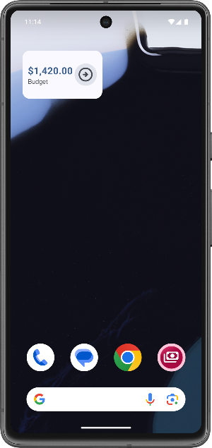
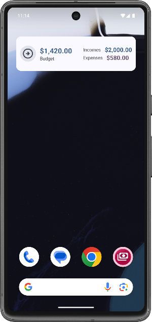
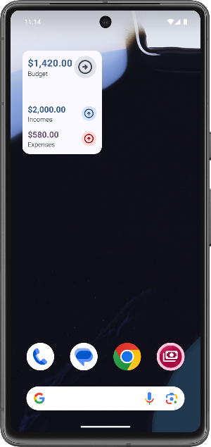
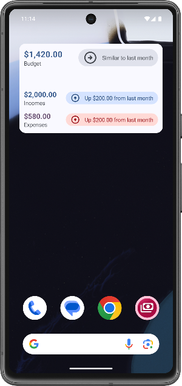

# App Widgets
This document describes the app widgets for the papp Cha Ching. Currently, there is only **one** widget.

###### Table of Contents
1. [Overview Widget](#1-overview-widget)

 

## 1 Overview Widget
The overview widget shows the budget for the last month. Depending on size, it may display incomes and expenses separately. Furthermore, the widget can display trends (i.e. if the budget, incomes or expenses are more, less or equal to the previous month).

The widget uses the `SmallAnalysisUseCase` to access the analysis data, although not all data returned is utilized by the widget.

The widget is implemented responsive. The minimum and default size is 1 x 2 cells (i.e. width = 140 dp). Once the widget gets wider or higher than that, the widget changes responsively to accomodate the larger area that is available.

The widget has four separate visual representations, depending on it's size:

Size | Widget
--- | ---
1 x 2 | 
1 x 4 | 
2 x 2 | 
2 x 4 | 

 

***

2025-12-30  
&copy; Christian-2003
