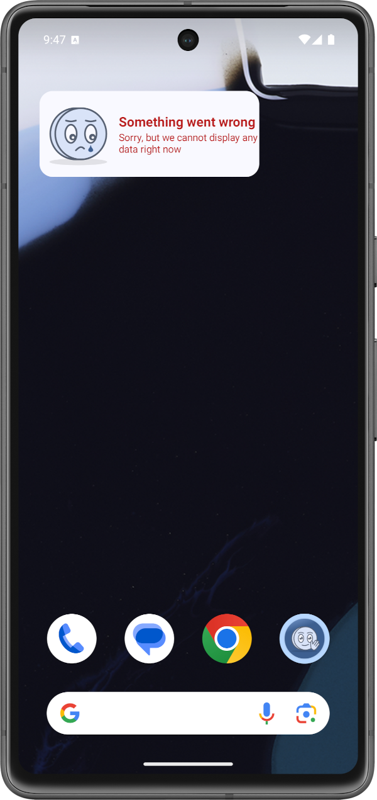

# App Widgets
This document describes the app widgets for the papp Cha Ching. Currently, there is only **one** widget.

###### Table of Contents
1. [Overview Widget](#overview-widget)

 

## Overview Widget
The overview widget shows the total amount of money earned in the last month (31 days). The widget is updated automatically every 30 minutes.

The widget is implemented responsive. The minimum and default size is 2 x 1 cells (i.e. width = 140 dp). Once the widget gets wider than that, the widget changes responsively to accomodate the larger area that is available.

The widget can display the following states:

State | Small size | Large size
--- | --- | ---
Normal |  | 
Empty |  | 
Error |  | 

The **normal** state displays the money earned in the last month.  
The **empty** state is displayed if no money has been earned in the last month.  
The **error** state is only displayed if some exception occurs during the calculation of the overview data.

 

***

2025-07-26  
&copy; Christian-2003
